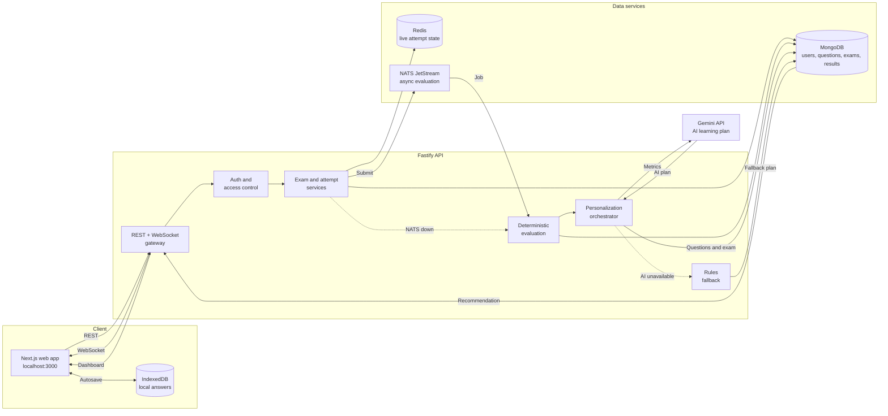

# MahaTest

MahaTest is an SSC mock-test platform for focused exam preparation. It combines a timed exam engine, a structured question bank, performance analytics, leaderboards, and automatically generated personalized tests based on weak topics.

The current product deliberately focuses on SSC exams. The web application does not expose Blog, Current Affairs, Practice, Bookmarks, or other exam categories.

## Product Capabilities

- SSC exam preparation across Reasoning, Quantitative Aptitude, English, and General Awareness
- Published mock exams with timers, question palette, mark-for-review, autosave, and evaluation
- Offline-safe local answer storage with API/WebSocket synchronization when available
- Student dashboard with results, analytics, leaderboards, and active personalized tests
- Admin question bank, taxonomy, exam, test-series, report, user, and settings workflows
- Idempotent SSC seed data with original exam-style questions and published starter mocks
- Personalized tests created after evaluation from weak topics and unseen published questions
- Gemini-first personalization for test title, description, study tip, topic priority, question distribution, and difficulty
- Deterministic rules-based fallback when Gemini is temporarily unavailable

## Architecture



The main path is Gemini-first. NATS is optional because evaluation can run inline, but `GEMINI_API_KEY` should be configured for the intended AI personalization experience.

Gemini never calculates marks, validates answers, authorizes users, or writes directly to MongoDB. Its output is parsed and validated before the API uses it. MongoDB remains the source of truth for questions and exams.

## How the Project Works

### 1. Startup

1. The API loads and validates environment variables.
2. MongoDB connects for permanent application data.
3. Redis connects for live exam state and short-lived cache data.
4. The API seeds configured admin accounts.
5. The API creates or updates the SSC category, subjects, chapters, topics, original questions, and starter exams. Seed records use stable markers and known slugs, so restarts are safe.
6. NATS JetStream is connected when available. If it is unavailable, the API enables inline evaluation.
7. The API starts on port 4000 and exposes `GET /health`.
8. The Next.js app starts on port 3000 and proxies browser API requests through `/backend/*`.

### 2. Authentication

1. A visitor registers or signs in through the Next.js app.
2. The API validates the request with Zod and hashes passwords with bcrypt.
3. The API returns a short-lived access token and sets an httpOnly refresh cookie.
4. The browser stores session state through the auth store and silently refreshes it on startup.
5. Protected routes require a valid access token. Admin routes additionally require `content_manager` or `super_admin` roles.

### 3. Student exam workflow

1. The student opens `/exams` and receives published SSC exams visible to that user.
2. Starting an exam creates an attempt with `in_progress` status, start time, end time, and user ownership.
3. The API returns a question package. The browser renders the timer, palette, options, mark-for-review state, and exam instructions.
4. Answers are saved locally in IndexedDB immediately.
5. The browser synchronizes answers through the API and WebSocket when connectivity is available.
6. The student submits the attempt. The attempt becomes `evaluating` until scoring completes.
7. The result page shows score, accuracy, question explanations, and evaluation details.

### 4. Evaluation and reliability

- Evaluation is deterministic and never delegated to AI.
- MongoDB stores the permanent attempt, answers, score, and question results.
- Redis stores temporary live-attempt state and supports recovery during short disconnects.
- NATS can distribute evaluation asynchronously through JetStream.
- If NATS is unavailable, the same evaluation service runs inline in the API.
- A failed Gemini request never prevents scoring or exam completion.

### 5. Admin content workflow

1. A content manager creates the SSC taxonomy: category, subject, chapter, and topic.
2. Questions are created with options, correct answers, explanations, difficulty, marks, and publication status.
3. Only published questions can be included in student exams.
4. An administrator creates an exam by selecting published question IDs.
5. The API calculates total marks from the selected questions and validates the exam data.
6. Publishing the exam makes it available to eligible students.
7. Reports and analytics read evaluated attempts without modifying the scoring history.

### 6. Data ownership

| Data | Primary store | Purpose |
|------|---------------|---------|
| Users, roles, questions, taxonomy | MongoDB | Permanent application data |
| Exams, attempts, results | MongoDB | Exam catalog and history |
| Active answers and timers | Redis + IndexedDB | Fast recovery and offline-safe interaction |
| Evaluation jobs | NATS JetStream | Optional asynchronous processing |
| AI plans and study tips | MongoDB exam metadata | Auditable personalization output |

### 7. Security boundaries

- The browser never receives the Gemini API key.
- Gemini receives sanitized topic metrics, not passwords, tokens, or full private answer sheets.
- Gemini cannot write directly to MongoDB.
- The API validates Gemini output before using it.
- Question selection comes from published MongoDB records, not arbitrary AI-generated IDs.
- Generated exams are filtered by `generatedFor` ownership.
- Archived personalized exams remain readable through history but are excluded from active recommendations.

## Personalized Test Working

The personalized test is created after an evaluated SSC attempt. It uses the existing exam engine, so the generated test behaves like any other mock exam.

### Creation flow

1. The student submits an exam.
2. The API saves the answers and evaluates score, accuracy, correct answers, wrong answers, and unattempted answers deterministically.
3. The API joins each result with its question topic and calculates topic performance.
4. A topic is considered weak when the student attempted at least two questions and scored below 70% accuracy.
5. The three lowest-accuracy weak topics are sent to Gemini as sanitized metrics containing only topic IDs, topic names, attempts, correct answers, and accuracy.
6. Gemini returns a validated plan containing:
  - Test title
  - Test description
  - Study tip
  - Topic priority
  - Question count per topic
  - Recommended difficulty
7. The API validates that Gemini only references the real weak topics and limits the plan to 5–20 questions.
8. MongoDB selects published questions matching the recommended topics and difficulty. Previously attempted questions are excluded when enough new questions exist.
9. The API creates a user-owned published exam and shows it in that student’s dashboard and exam list.

### Fallback behavior

If Gemini is unavailable, times out, returns invalid JSON, or returns an invalid topic, the API uses a deterministic fallback plan. The test still gets created using the lowest-accuracy topics with balanced medium-difficulty questions.

If fewer than five unseen questions exist, the system reuses weak-topic questions as revision material instead of failing to create a test.

### After the student passes

When a personalized test reaches 70% accuracy or higher:

- The test is marked `archived` and removed from active recommendations.
- The attempt and result remain available for history and analytics.
- The next recommendation focuses on remaining weak topics.
- The same source attempt cannot create duplicate personalized exams.

Personalized exams store their owner, source attempt, selected question IDs, AI-generated metadata, and study tip. Other students cannot see or start another student’s generated test.

## Repository Layout

```text
apps/
  web/                         Next.js website, auth, dashboards, exam UI
  api/                         Fastify REST API, evaluation, WebSocket sync, seeding
packages/
  eslint-config/               Shared ESLint configuration
  tailwind-config/             Shared Tailwind theme
  typescript-config/           Shared TypeScript configuration
docker/
  docker-compose.yml           MongoDB, Redis, and NATS development services
  docker-compose.prod.yml      Production service definitions
README.md                      Project setup, architecture, and workflows
```

## Requirements

- Node.js 20 or newer
- pnpm 10 or newer
- MongoDB
- Redis
- NATS is optional because the API has inline evaluation fallback
- Gemini API key is required for the primary AI personalization path
- Docker Desktop is optional when MongoDB and Redis are installed locally

## Quick Start

Install dependencies from the repository root:

```bash
pnpm install
```

Start local infrastructure with Docker:

```bash
docker compose -f docker/docker-compose.yml up -d mongo redis
```

Start the API and web app in separate terminals:

```bash
pnpm --filter @mahatest/api dev
pnpm --filter @mahatest/web dev
```

Open:

- Website: http://localhost:3000
- API health: http://localhost:4000/health

The API seeds admin accounts, SSC taxonomy, original questions, and starter exams when MongoDB is connected. Seeding is idempotent.

Start NATS when asynchronous evaluation is desired:

```bash
docker compose -f docker/docker-compose.yml up -d nats
```

Without NATS, exam evaluation runs inline in the API process.

## Environment

Create `apps/api/.env` with local values. Never commit this file or share its secrets.

Important variables:

```dotenv
NODE_ENV=development
PORT=4000
HOST=0.0.0.0
MONGODB_URI=mongodb://127.0.0.1:27017/mahatest
REDIS_URL=redis://127.0.0.1:6379
WEB_ORIGIN=http://localhost:3000
NATS_URL=nats://127.0.0.1:4222

# Required for Gemini-first personalized tests. The API accepts the legacy GeminiAPI name temporarily.
GEMINI_API_KEY=replace-with-a-server-side-key
GEMINI_MODEL=gemini-3.6-flash

SUPER_ADMIN_EMAIL=admin@example.com
SUPER_ADMIN_PASSWORD=change-this-password
SUPER_ADMIN_NAME=Super Admin
```

The web app uses a same-origin `/backend/*` rewrite to the API, which keeps local authentication cookies on the web origin. Without `GEMINI_API_KEY`, personalized tests still work through the deterministic fallback, but they will not receive AI-generated names, study tips, or adaptive distribution.

## Common Workflows

### Student

1. Register or sign in.
2. Open **Exams** and select an SSC mock.
3. Complete the timed attempt.
4. Review the result and analytics.
5. Open the dashboard recommendation created from weak topics.
6. Personalized tests scoring 70% or higher are archived from active recommendations while their results remain available.

### Content manager

1. Register an account.
2. Promote it from the API package:

   ```bash
   pnpm --filter @mahatest/api promote -- you@example.com content_manager
   ```

3. Sign out and sign in again.
4. Use `/admin/question-bank` to manage taxonomy and questions.
5. Use `/admin/exams` to create and publish SSC exams.

### Seed content

The startup seed creates or updates only records owned by the seed markers and known exam slugs. It does not delete user-created content.

The current starter content includes:

- 50 original SSC questions
- Reasoning, Quantitative Aptitude, English, and General Awareness taxonomy
- Three published 20-question SSC mocks

## Validation Commands

Run from the repository root:

```bash
pnpm typecheck
pnpm lint
pnpm build
```

Run package-specific checks:

```bash
pnpm --filter @mahatest/api typecheck
pnpm --filter @mahatest/api lint
pnpm --filter @mahatest/web typecheck
pnpm --filter @mahatest/web lint
pnpm --filter @mahatest/web build
```

Check service health:

```bash
curl http://localhost:4000/health
```

Expected API status includes MongoDB and Redis connectivity. NATS may report `inline-fallback` when it is not running.

## Security Notes

- Keep `apps/api/.env` out of Git.
- Rotate any key or password that has been shared publicly.
- Keep Gemini calls server-side only.
- Do not send passwords, tokens, answer sheets, or private account data to Gemini.
- Treat Gemini output as an untrusted recommendation and validate it before use.

## Documentation

This README contains the current setup, architecture, development workflows, and operational guidance for the project.
