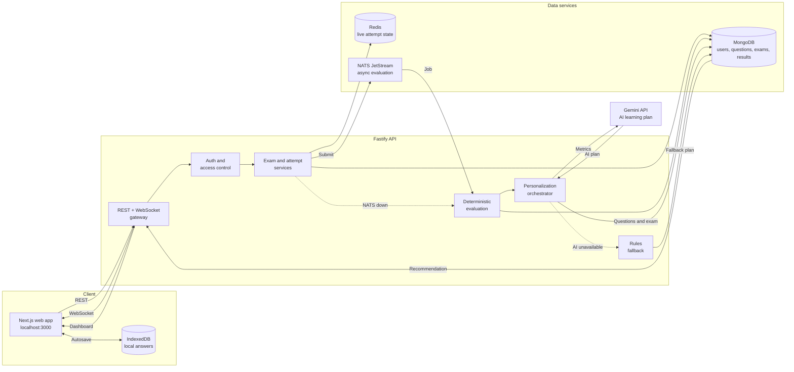

# MahaTest

MahaTest is an SSC mock-test platform for focused exam preparation. It combines a timed exam engine, a structured question bank, performance analytics, leaderboards, and automatically generated personalized tests based on weak topics.

The current product deliberately focuses on SSC exams. The web application does not expose Blog, Current Affairs, Practice, Bookmarks, or other exam categories.

## Product Capabilities

- SSC exam preparation across Reasoning, Quantitative Aptitude, English, and General Awareness
- Published mock exams with timers, question palette, mark-for-review, autosave, and evaluation
- Offline-safe local answer storage with API/WebSocket synchronization when available
- Student dashboard with results, analytics, leaderboards, and active personalized tests
- Admin question bank, taxonomy, exam, test-series, report, user, and settings workflows
- Idempotent SSC seed data with original exam-style questions and published starter mocks
- Personalized tests created after evaluation from weak topics and unseen published questions
- Gemini-first personalization for test title, description, study tip, topic priority, question distribution, and difficulty
- Deterministic rules-based fallback when Gemini is temporarily unavailable

## Architecture



The main path is Gemini-first. NATS is optional because evaluation can run inline, but `GEMINI_API_KEY` should be configured for the intended AI personalization experience.

Gemini never calculates marks, validates answers, authorizes users, or writes directly to MongoDB. Its output is parsed and validated before the API uses it. MongoDB remains the source of truth for questions and exams.

## Repository Layout

```text
apps/
  web/                         Next.js website, auth, dashboards, exam UI
  api/                         Fastify REST API, evaluation, WebSocket sync, seeding
packages/
  eslint-config/               Shared ESLint configuration
  tailwind-config/             Shared Tailwind theme
  typescript-config/           Shared TypeScript configuration
docker/
  docker-compose.yml           MongoDB, Redis, and NATS development services
  docker-compose.prod.yml      Production service definitions
README.md                      Project setup, architecture, and workflows
```

## Requirements

- Node.js 20 or newer
- pnpm 10 or newer
- MongoDB
- Redis
- NATS is optional because the API has inline evaluation fallback
- Gemini API key is required for the primary AI personalization path
- Docker Desktop is optional when MongoDB and Redis are installed locally

## Quick Start

Install dependencies from the repository root:

```bash
pnpm install
```

Start local infrastructure with Docker:

```bash
docker compose -f docker/docker-compose.yml up -d mongo redis
```

Start the API and web app in separate terminals:

```bash
pnpm --filter @mahatest/api dev
pnpm --filter @mahatest/web dev
```

Open:

- Website: http://localhost:3000
- API health: http://localhost:4000/health

The API seeds admin accounts, SSC taxonomy, original questions, and starter exams when MongoDB is connected. Seeding is idempotent.

Start NATS when asynchronous evaluation is desired:

```bash
docker compose -f docker/docker-compose.yml up -d nats
```

Without NATS, exam evaluation runs inline in the API process.

## Environment

Create `apps/api/.env` with local values. Never commit this file or share its secrets.

Important variables:

```dotenv
NODE_ENV=development
PORT=4000
HOST=0.0.0.0
MONGODB_URI=mongodb://127.0.0.1:27017/mahatest
REDIS_URL=redis://127.0.0.1:6379
WEB_ORIGIN=http://localhost:3000
NATS_URL=nats://127.0.0.1:4222

# Required for Gemini-first personalized tests. The API accepts the legacy GeminiAPI name temporarily.
GEMINI_API_KEY=replace-with-a-server-side-key
GEMINI_MODEL=gemini-3.6-flash

SUPER_ADMIN_EMAIL=admin@example.com
SUPER_ADMIN_PASSWORD=change-this-password
SUPER_ADMIN_NAME=Super Admin
```

The web app uses a same-origin `/backend/*` rewrite to the API, which keeps local authentication cookies on the web origin. Without `GEMINI_API_KEY`, personalized tests still work through the deterministic fallback, but they will not receive AI-generated names, study tips, or adaptive distribution.

## Common Workflows

### Student

1. Register or sign in.
2. Open **Exams** and select an SSC mock.
3. Complete the timed attempt.
4. Review the result and analytics.
5. Open the dashboard recommendation created from weak topics.
6. Personalized tests scoring 70% or higher are archived from active recommendations while their results remain available.

### Content manager

1. Register an account.
2. Promote it from the API package:

   ```bash
   pnpm --filter @mahatest/api promote -- you@example.com content_manager
   ```

3. Sign out and sign in again.
4. Use `/admin/question-bank` to manage taxonomy and questions.
5. Use `/admin/exams` to create and publish SSC exams.

### Seed content

The startup seed creates or updates only records owned by the seed markers and known exam slugs. It does not delete user-created content.

The current starter content includes:

- 50 original SSC questions
- Reasoning, Quantitative Aptitude, English, and General Awareness taxonomy
- Three published 20-question SSC mocks

## Validation Commands

Run from the repository root:

```bash
pnpm typecheck
pnpm lint
pnpm build
```

Run package-specific checks:

```bash
pnpm --filter @mahatest/api typecheck
pnpm --filter @mahatest/api lint
pnpm --filter @mahatest/web typecheck
pnpm --filter @mahatest/web lint
pnpm --filter @mahatest/web build
```

Check service health:

```bash
curl http://localhost:4000/health
```

Expected API status includes MongoDB and Redis connectivity. NATS may report `inline-fallback` when it is not running.

## Security Notes

- Keep `apps/api/.env` out of Git.
- Rotate any key or password that has been shared publicly.
- Keep Gemini calls server-side only.
- Do not send passwords, tokens, answer sheets, or private account data to Gemini.
- Treat Gemini output as an untrusted recommendation and validate it before use.

## Documentation

This README contains the current setup, architecture, development workflows, and operational guidance for the project.
